# 📚 SQL Learning Repository

A structured collection of SQL queries and exercises focused on fundamental database operations, aggregation functions, and table joins using a bookstore database.

## 📁 Project Structure

```
SQL/
├── Phase 1 Fundamentals of Sql/
│   ├── Insert.sql          # Database schema and initial data setup
│   └── functional.sql      # Filtering and sorting operations
├── Phase 2 Aggregation and JOINS/
│   └── Aggregation and joins.sql  # Aggregate functions and table joins
└── data.csv                # Sample data file
```

## 🎯 Learning Phases

### Phase 1: SQL Fundamentals
**Focus**: Basic querying, filtering, and sorting

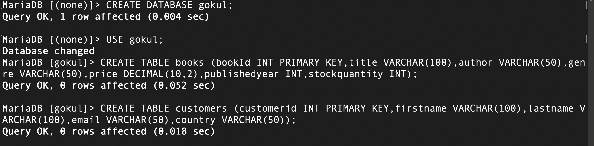
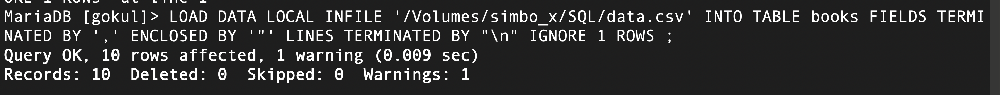
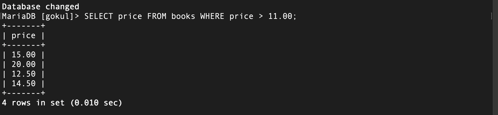
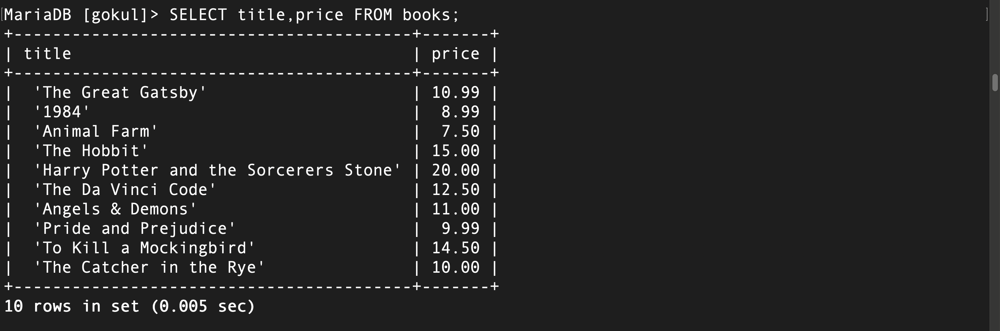
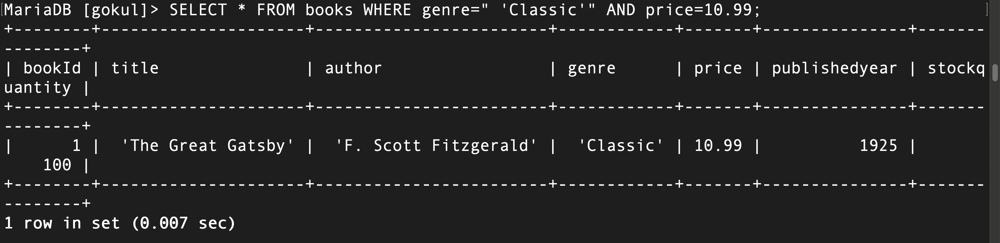
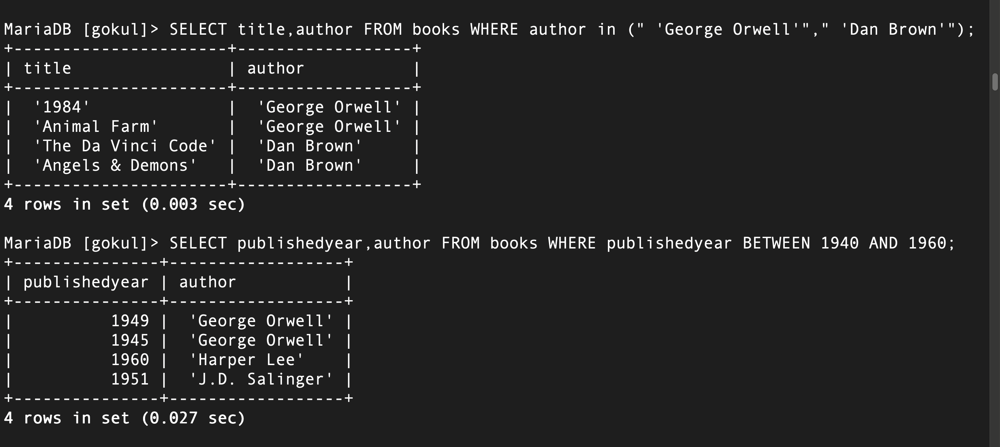
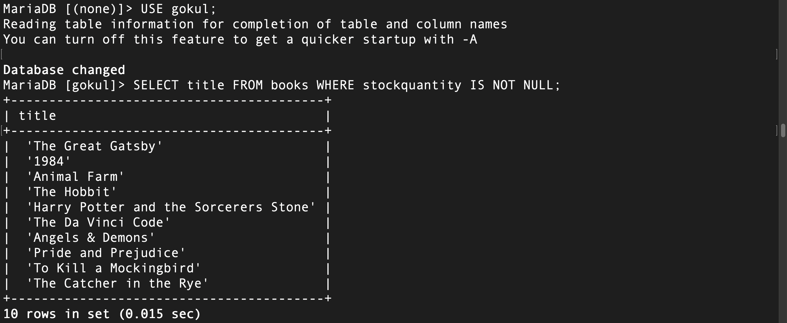
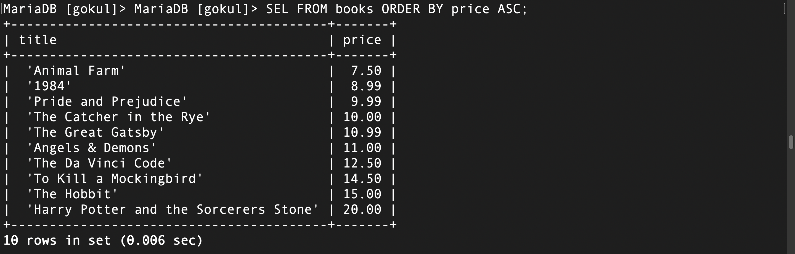

**Topics Covered**:
- WHERE clause with comparison operators (`=`, `<`, `>`, `<=`, `>=`, `<>`)
- Logical operators (`AND`, `OR`)
- `IN` operator for multiple value matching
- `BETWEEN` operator for range queries
- Pattern matching with `LIKE` (`%`, `_`)
- NULL value handling

**Database Schema**:
- **Books**: BookID, Title, Author, Genre, Price, PublishedYear, StockQuantity
- **Customers**: CustomerID, FirstName, LastName, Email, Country

### Phase 2: Advanced Operations
**Focus**: Aggregation and relationships between tables

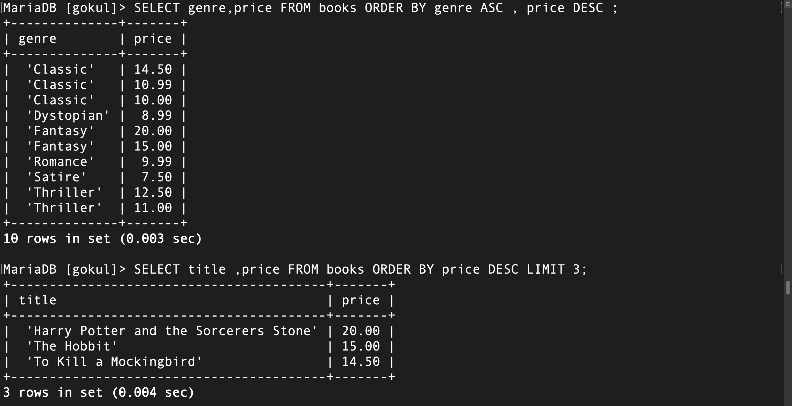
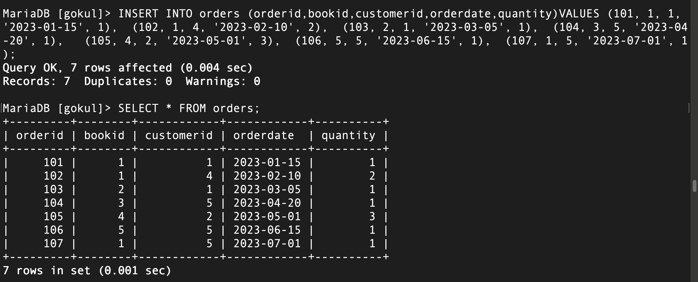
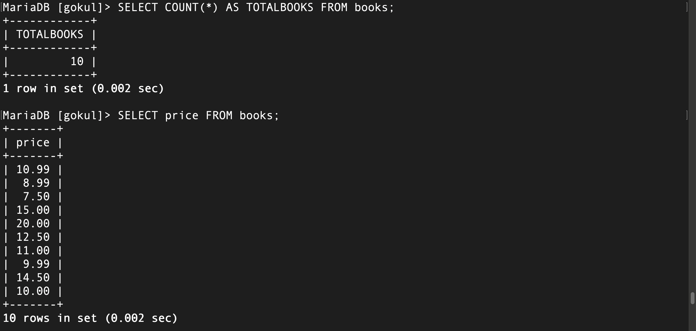
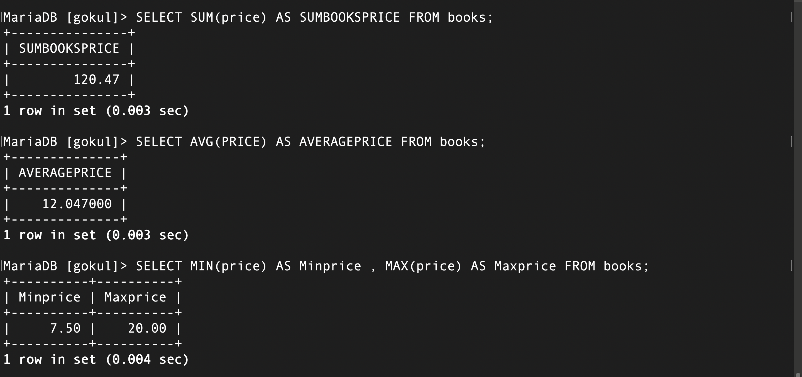
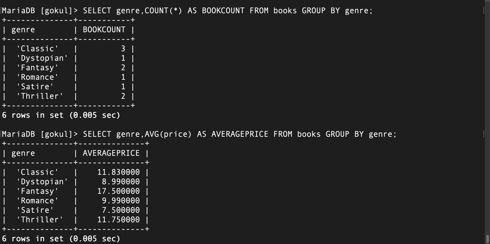
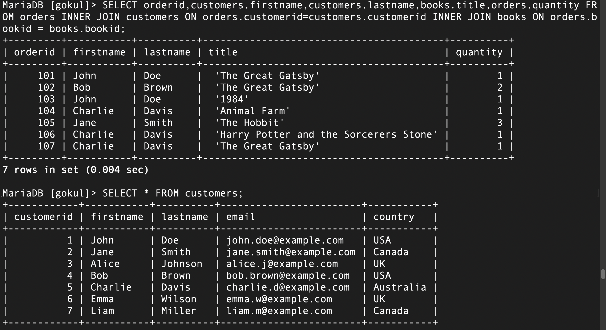
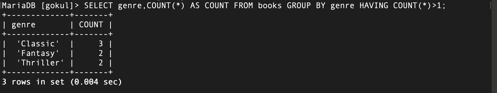
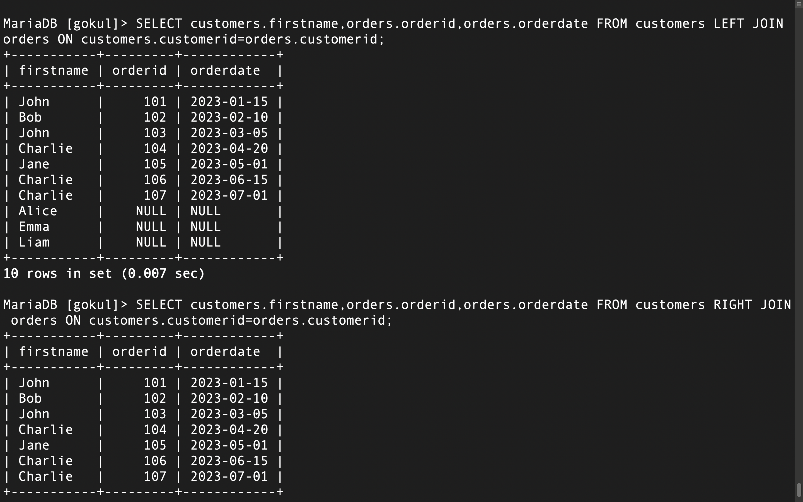
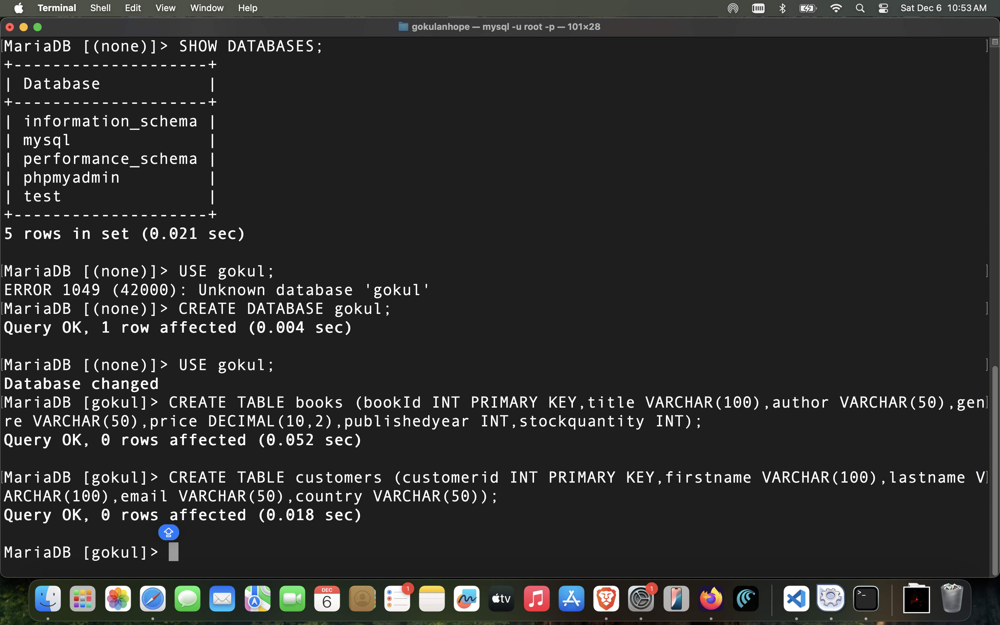

**Topics Covered**:
- Aggregate functions (`COUNT`, `SUM`, `AVG`, `MIN`, `MAX`)
- `GROUP BY` clause
- `HAVING` clause for filtered aggregation
- INNER JOIN
- LEFT/RIGHT/FULL OUTER JOINs
- Combining multiple tables

**Extended Schema**:
- **Orders**: OrderID, CustomerID, BookID, OrderDate, Quantity

## 🚀 Getting Started

1. **Set up the database**:
   ```sql
   -- Run Insert.sql first to create tables and populate data
   ```

2. **Practice fundamentals**:
   ```sql
   -- Work through functional.sql for basic queries
   ```

3. **Explore advanced topics**:
   ```sql
   -- Complete Aggregation and joins.sql exercises
   ```

## 💡 Sample Queries

**Basic Filtering**:
```sql
SELECT Title, Price 
FROM Books 
WHERE Price < 11.00;
```

**Aggregation**:
```sql
SELECT COUNT(*) AS TotalBooks 
FROM Books;
```

**Joins**:
```sql
SELECT c.FirstName, o.OrderID 
FROM Customers c
JOIN Orders o ON c.CustomerID = o.CustomerID;
```

## 📖 Dataset

The bookstore database includes:
- 10 classic and modern books
- 6 customers from different countries
- Sample order history for join practice

## 🎓 Learning Objectives

- Master SQL query syntax and structure
- Understand data filtering and pattern matching
- Perform calculations using aggregate functions
- Combine data from multiple tables using joins
- Write efficient and readable SQL queries

---

*Happy querying! 🔍*
